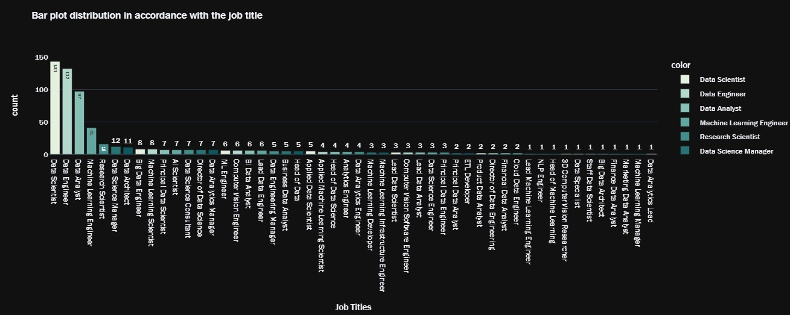
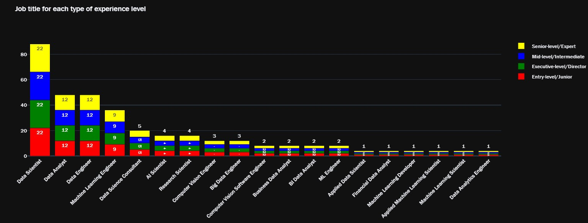

# Why I did this project

In the contemporary business era, data has ascended as an integral pivot shaping decisions across industries. The World Economic Forum anticipates that by 2025, daily global data production will reach a staggering 463 exabytes. This boom underscores the burgeoning demand for experts adept at navigating and deciphering this expansive data sea, consequently amplifying roles such as data scientists, machine learning engineers, and big data engineers.

The Harvard Business Review heralded the data scientist as the "21st century's most enticing job." As enterprises discern the dividends of data-centric strategies, the quest for professionals who can distill vast data into actionable insights has intensified. This assertion finds resonance in LinkedIn's data, noting a 650% surge in data science roles since 2012.

As data scientists ascend in demand, there's a parallel surge for machine learning engineers and scientists. Amid the expanding embrace of automation and artificial intelligence, experts adept at devising and deploying machine learning models are now quintessential. These mavens bridge the chasm between academic machine learning innovations and tangible business applications.

However, the data deluge brings with it the quandary of efficient storage, processing, and retrieval. This is where big data engineers step in, architecting resilient and scalable data frameworks. Their acumen ensures that incoming data torrents are systematically orchestrated, facilitating incisive analysis.

At the helm of data structures stands the data architect, tasked with crafting data ecosystems. Their blueprints delineate the trajectory of data storage, integration, and deployment across diverse platforms and units. As firms evolve with a data-oriented DNA, the indispensability of a robust architecture accentuates, heightening the demand for data architects.

But it's not just the foundational roles seeing an upswing; leadership positions like the principle data scientist are also gaining traction. Such individuals meld technical prowess with a strategic acumen, navigating both the granular realms of data and orchestrating teams towards overarching business goals.

This crescendo in data-centric roles epitomizes the inexorable shift towards a data-anchored global landscape. As firms amplify their reliance on data for a competitive vantage, the trajectory for these professions seems steeply upward. Those seeking a resilient career path would find the vast horizons of data science and its auxiliary domains exceptionally promising.

## Quick summary of the result

Barplot distribution for the job title

Pie distribution for particular level of experience

Remote Work distribution

Job title for expereince level

Co-relation b/w experience level salary and job title for 2020, 2021 and 2022 respectively

## Conclusion

The prominence of data science roles is on a marked rise. 

For professionals eyeing the zenith of pay scales, the United States emerges as the front-runner. However, it's essential to contextualize this perspective. While the U.S. does offer higher salaries, a holistic understanding would entail examining factors like the cost of living, healthcare provisions, and more.

Larger and medium-sized companies tend to be more generous with compensation compared to their smaller counterparts.

As we stride into 2022, contract-based and full-time positions appear to be the most lucrative employment types.

Roles like Data Engineers, Data Scientists, and Machine Learning Engineers stand out, commanding noteworthy average salaries, showcasing their market value.

The ascendancy of remote positions is evident, both in terms of popularity and pay scale. This shift could arguably be attributed to the recent pandemic.

A significant uptick in salary can be observed as one transitions into senior-level roles.

It's imperative to note that a substantial portion of our dataset originates from the U.S., where wages are notably higher than in other nations. Consequently, the presented average salaries might not be truly representative of global trends. Using them as a yardstick for global salary expectations might be misleading.

Concluding from the analysis, venturing into a data science-centric career path seems promising, especially considering the salary prospects and flexibility of remote work.

## License

[MIT](https://choosealicense.com/licenses/mit/)
