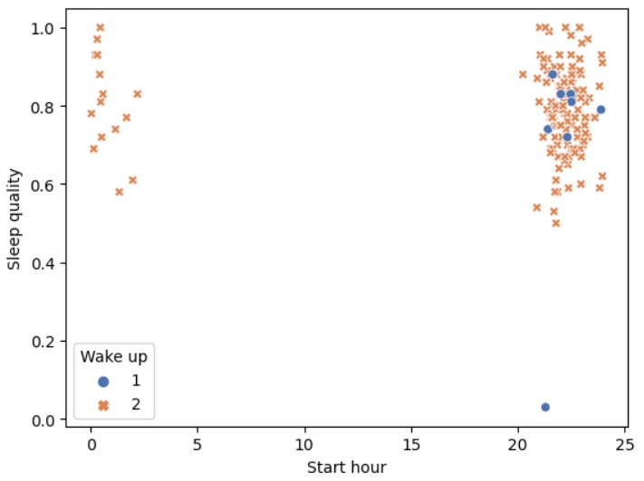
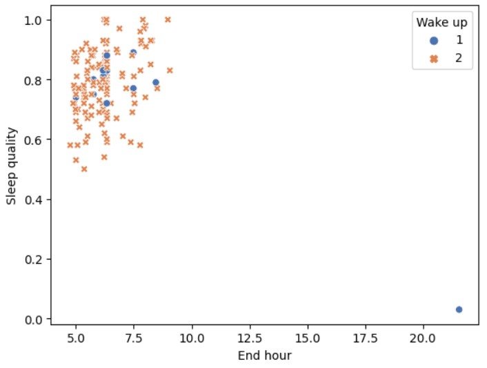
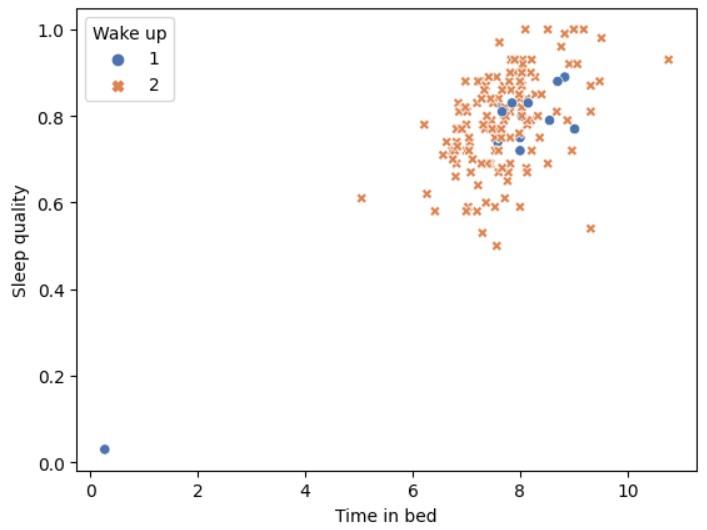
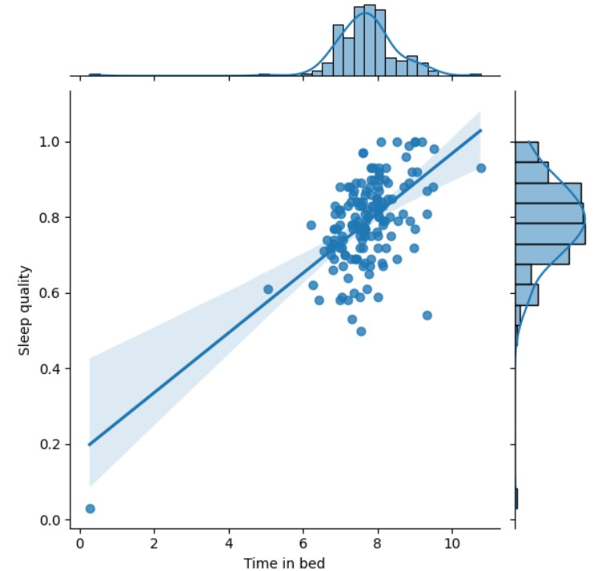

# The project motivation

Sleep is a fundamental human need that greatly impacts both physical and mental well-being. According to the National Sleep Foundation, a consistent sleep schedule reinforces the body's natural circadian rhythm, enhancing overall sleep quality. This, in turn, promotes better hormonal balance and aids critical bodily functions like tissue repair.

Moreover, the Harvard Medical School emphasizes that sleep plays a pivotal role in cognitive processes. Lack of sleep impairs attention, alertness, problem-solving, and decision-making skills. It can also lead to mood disturbances such as irritability, anxiety, or even depression. This is largely attributed to the brain's processing and consolidation of the day's experiences during rest, facilitating memory and learning.

Additionally, chronic sleep deprivation has been linked to a range of serious health conditions. The Centers for Disease Control and Prevention (CDC) notes that it elevates the risk of chronic ailments like obesity, diabetes, cardiovascular diseases, and even a weakened immune system. Therefore, prioritizing sleep is not just about mental sharpness; it's a cornerstone of comprehensive health.

## Quick summary of the result

Scatterplot for sleep v/s Start Hour

Scatterplot for sleep v/s End Hour

Scatterplot for sleep v/s Time in Bed

Jointplot fot sleep v/s time in bed

## Conclusion

From all the above Analysis and Visualization we can cleary conclude that, A Person Who Sleeps Better(i.e, in between 6 to 8 hours) and has possitive self affirmations (which may also include drinking coffee) will have a higher sleep quality. Additionally the notion of "Early to bed, early to rise; makes you wealthy and wise" turns to be true as the best sleep quality if for those who slept between 9PM and 5AM

## License

[MIT](https://choosealicense.com/licenses/mit/)
